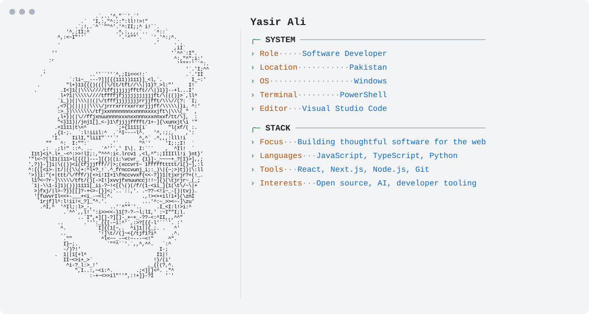

<a href="https://github.com/yasir-ali9">
  <picture>
    <source media="(prefers-color-scheme: dark)" srcset="./assets/dark.svg">
    <source media="(prefers-color-scheme: light)" srcset="./assets/light.svg">
    
  </picture>
</a>

<!--
  Edit profile.json to change the text shown in the card.
  The GitHub statistics are refreshed daily by .github/workflows/profile.yml.
-->
