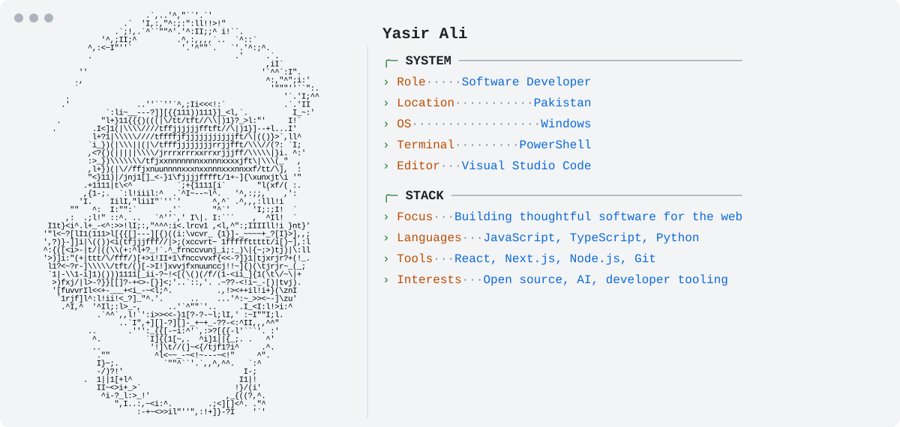

<picture>
  <source media="(prefers-color-scheme: dark)" srcset="./assets/dark-v5.svg">
  <source media="(prefers-color-scheme: light)" srcset="./assets/light-v5.svg">
  
</picture>

<!--
  Edit profile.json to change the text shown in the card.
  The GitHub statistics are refreshed daily by .github/workflows/profile.yml.
-->
