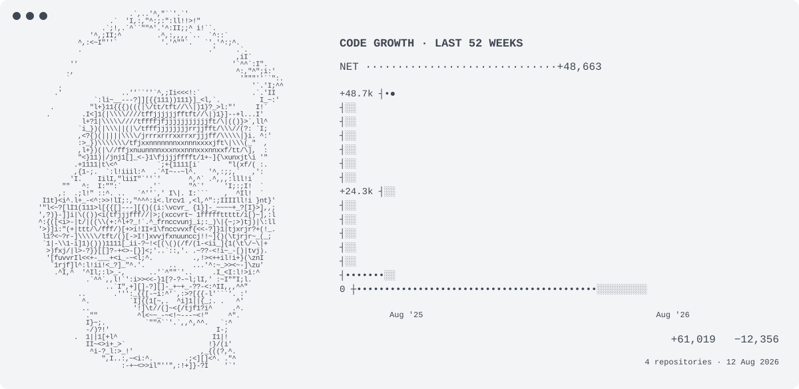

<picture>
  <source media="(prefers-color-scheme: dark)" srcset="./assets/dark-v8.svg">
  <source media="(prefers-color-scheme: light)" srcset="./assets/light-v8.svg">
  
</picture>

<!--
  The real 52-week code-growth graph is refreshed daily by
  .github/workflows/profile.yml using GitHub's code-frequency data.
-->
